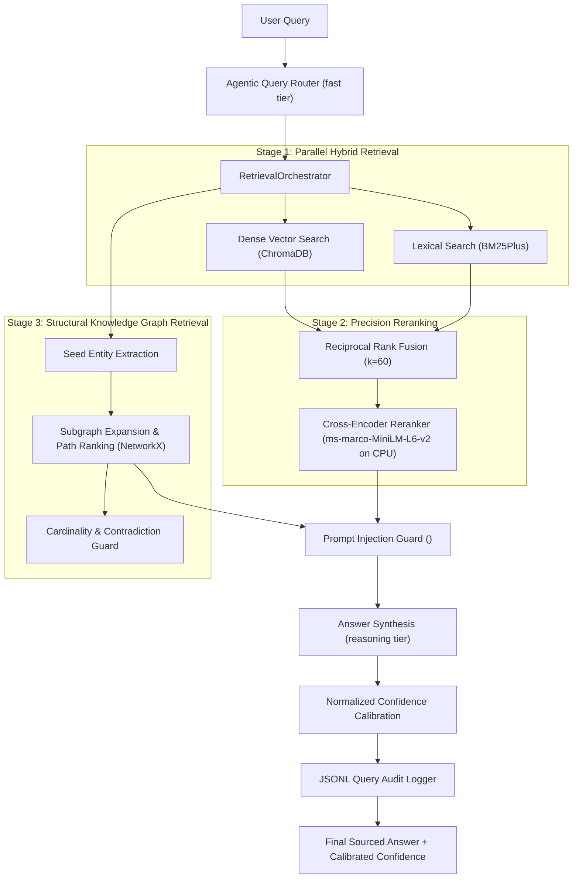

# GraphMind Enterprise Architecture & Technical Specification

*Version: 0.2.0 (Enterprise Hybrid RAG)*  
*Architecture: Multi-Stage Hybrid RAG + Structural Knowledge Graph*

---

## 1. Executive System Overview

GraphMind is an enterprise-grade Knowledge Notebook and Question-Answering system designed to run entirely locally or in hybrid cloud environments without sacrificing latency, privacy, or reasoning capability.

It overcomes standard vector RAG limitations (isolated chunks, loss of relational topology, semantic drift on technical IDs) by pairing dense vector retrieval with lexical keyword search (BM25Plus), Reciprocal Rank Fusion (RRF), a local CPU cross-encoder reranker, and path-ranked knowledge graph traversal.



---

## 2. Core Architectural Pillars

### 2.1 Multi-Stage Retrieval Pipeline
1. **Parallel Stage 1 (Dense + Lexical)**:
   - **Dense Vectors**: ChromaDB embeddings via `text-embedding-004` (Gemini) or `nomic-embed-text` (Ollama).
   - **Lexical Search**: `BM25Plus` from `rank_bm25`, customized to retain technical alphanumeric codes (e.g. `ERR_404_NOT_FOUND`, `RFC-7231`). `BM25Plus` eliminates the negative IDF penalty observed in standard Okapi on smaller corpora.
2. **Reciprocal Rank Fusion (RRF)**:
   $$\text{RRF}(d) = \sum_{m \in \{\text{dense}, \text{bm25}\}} \frac{1}{60 + \text{rank}_m(d)}$$
   Dedupes passages by deterministic chunk IDs and retains rank signals for explainability.
3. **Stage 2 Precision Reranking**:
   - `cross-encoder/ms-marco-MiniLM-L6-v2` loaded lazily on CPU (saving 4GB GPU VRAM for Ollama LLM inference).
   - Re-scores top candidate passages to optimize NDCG@5.
4. **Stage 3 Structural Graph Path (Separate Path)**:
   - Knowledge graph relations are **not** pooled into RRF passage ranks. Graph edges represent relational topology, not independent text passages.
   - Graph seeds are extracted from the query and top passages, expanded up to 2 hops, and scored via path ranking:
     $$\text{Score}(e) = \frac{\text{support\_count} \times 2.0}{\text{depth} + 1}$$

---

## 3. Knowledge Graph Engine & Contradiction Detection

1. **Rich Evidence Spans**:
   Every edge in the NetworkX graph maintains an `evidence` list tracking:
   ```json
   {
     "source": "filing_2024.pdf",
     "page": 2,
     "chunk_id": "filing_2024.pdf_p2_c1",
     "text": "Acme Corp was founded in 1998 by John Doe.",
     "confidence": 1.0
   }
   ```
2. **Cardinality-Aware Contradiction Detection**:
   GraphMind maintains an ontological cardinality schema:
   - `one`: `founded_in`, `born_in`, `headquartered_in`, `died_in`, `ceo_of`, `president_of`
   - `many`: `author_of`, `invested_in`, `features`, `supports`, `contradicts`, `works_at`
   When an edge with cardinality `"one"` is added with conflicting target nodes across documents, a contradiction event is recorded and surfaced in the UI.

---

## 4. Security & Access Control

1. **Prompt Injection Defense**:
   - Invariant: **Detect and isolate without mutating or stripping source text.**
   - Uses `PromptInjectionDetector` to scan for adversarial sequences (`ignore previous instructions`, `disregard above`, `developer mode`).
   - Untrusted documents are wrapped in `<untrusted_document>` tags with risk annotations, while all context is contained within `<retrieved_documents>` delimiters.
2. **Source-Level Access Control (ACL)**:
   - Enforces the strict intersection rule:
     $$\text{Effective Sources} = \text{ACL\_Allowed} \cap \text{User\_Selected}$$
   - Prevents unauthorized cross-tenant data leakage.

---

## 5. Normalized Confidence Calibration

Rather than trusting uncalibrated LLM self-reflection scores, GraphMind calculates confidence using normalized observable feature signals:
- **Citation Grounding (35%)**: Density of verifiable brackets `[1]`, `[Doc: ...]` linking to retrieved chunks.
- **Retrieval Coverage (25%)**: Breadth of top chunks directly supporting the query.
- **Graph Evidence (20%)**: Presence of verified structural relationship triples.
- **Model Reflection (20%)**: Normalized internal model confidence.

---

## 6. Observability & Performance

- **Query Audit Logging**: Every query execution appends structured telemetry to `data/audit_log.jsonl` (latency, category, chunk count, confidence, effective sources).
- **In-Memory LRU Cache**: Thread-safe LRU cache with TTL for embeddings and frequent query routing.
- **Dual Surface**:
  - Interactive Streamlit notebook interface ([app.py](file:///d:/Users/Admin/Documents/GitHub/GraphMind/GraphMind/app.py))
  - Headless REST API ([src/api.py](file:///d:/Users/Admin/Documents/GitHub/GraphMind/GraphMind/src/api.py))
